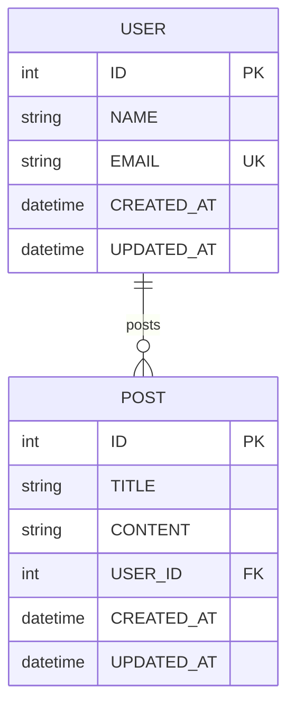

# Foundry Architecture Documentation
### Enterprise-Grade ERD Processing Pipeline

---

## Table of Contents

1. [System Overview](#system-overview)
2. [Pipeline Architecture](#pipeline-architecture)
3. [Module Breakdown](#module-breakdown)
4. [Data Flow](#data-flow)
5. [Type System](#type-system)
6. [Design Patterns](#design-patterns)
7. [Scalability Considerations](#scalability-considerations)

---

## System Overview

Foundry is a **production-grade ERD-to-code generator** that leverages IBM watsonx.ai vision intelligence to transform database diagrams into complete, deployable Node.js backends. The system is architected around a **4-stage pipeline** that strictly separates AI extraction from deterministic code generation.

### Core Principles

1. **Separation of Concerns**: AI handles visual extraction; deterministic generators handle code output
2. **Type Safety**: Strongly-typed TypeScript interfaces throughout the entire pipeline
3. **Determinism**: Same input AST always produces identical output code
4. **Modularity**: Each component is independently testable and replaceable
5. **Production-Ready**: Enterprise-grade error handling, validation, and logging

### Technology Stack

```
┌─────────────────────────────────────────────────────────────┐
│                     FOUNDRY STACK                           │
├─────────────────────────────────────────────────────────────┤
│  Frontend:  Next.js 14 App Router + React 18 + TypeScript  │
│  AI Layer:  IBM watsonx.ai Llama 3.2 90B Vision            │
│  ORM:       Prisma 5.0 (PostgreSQL/MySQL/SQLite)           │
│  Validation: Zod + Custom AST Validators                    │
│  UI:        Tailwind CSS + Monaco Editor + Mermaid.js      │
│  DevOps:    Docker + GitHub Actions + Postman              │
└─────────────────────────────────────────────────────────────┘
```

---

## Pipeline Architecture

### High-Level Flow

```
┌──────────────┐
│  ERD Image   │
│  (PNG/JPG)   │
└──────┬───────┘
       │
       ▼
┌──────────────────────────────────────────────────────────┐
│  STAGE 1: AI EXTRACTION                                  │
│  lib/ai/extractor.ts                                     │
│  ─────────────────────────────────────────────────────── │
│  • Authenticate with IBM Cloud IAM                       │
│  • Call watsonx.ai Vision API                            │
│  • Parse JSON response (3 fallback strategies)           │
│  • Return: AIExtractionResult                            │
└──────┬───────────────────────────────────────────────────┘
       │
       ▼
┌──────────────────────────────────────────────────────────┐
│  STAGE 2: AST BUILDING                                   │
│  lib/parser/ast-builder.ts                               │
│  ─────────────────────────────────────────────────────── │
│  • Map AI types → Prisma types                           │
│  • Map relation types → RelationType enum                │
│  • Normalize all names (PascalCase/camelCase)            │
│  • Return: ERDAST (strongly-typed)                       │
└──────┬───────────────────────────────────────────────────┘
       │
       ▼
┌──────────────────────────────────────────────────────────┐
│  STAGE 3: VALIDATION                                     │
│  lib/validators/erd-validator.ts                         │
│  ─────────────────────────────────────────────────────── │
│  • Remove duplicate models/relations                     │
│  • Remove self-relations                                 │
│  • Infer missing inverse relations                       │
│  • Add foreign key fields                                │
│  • Validate all references                               │
│  • Return: ValidatedERDAST                               │
└──────┬───────────────────────────────────────────────────┘
       │
       ▼
┌──────────────────────────────────────────────────────────┐
│  STAGE 4: CODE GENERATION                                │
│  lib/generators/*.ts                                     │
│  ─────────────────────────────────────────────────────── │
│  • generatePrismaSchema()    → schema.prisma             │
│  • generateApiRoutes()       → routes.ts                 │
│  • generateZodSchemas()      → validation.ts             │
│  • generateSeedScript()      → seed.ts                   │
│  • generateMermaidDiagram()  → ERD visualization         │
│  • Return: GeneratedCode (5 outputs)                     │
└──────┬───────────────────────────────────────────────────┘
       │
       ▼
┌──────────────┐
│  13-File ZIP │
│  Bundle      │
└──────────────┘
```

### Pipeline Orchestration

The `lib/pipeline/orchestrator.ts` module coordinates all stages:

```typescript
export async function processERDImage(
  imageBuffer: Buffer,
  dbType: string = 'postgresql'
): Promise<GeneratedCode> {
  // Stage 1: AI Extraction
  const aiResult = await extractERDStructure(imageBuffer);
  
  // Stage 2: AST Building
  const ast = buildERDAST(aiResult);
  
  // Stage 3: Validation
  const validatedAST = validateERDAST(ast);
  
  // Stage 4: Code Generation
  return {
    prismaSchema: generatePrismaSchema(validatedAST, dbType),
    apiRoutes: generateApiRoutes(validatedAST),
    zodSchemas: generateZodSchemas(validatedAST),
    seedScript: generateSeedScript(validatedAST),
    mermaidDiagram: generateMermaidDiagram(validatedAST)
  };
}
```

---

## Module Breakdown

### 1. AI Extraction Layer (`lib/ai/`)

**Purpose**: Extract structured data from ERD images using IBM watsonx.ai

**Key File**: `lib/ai/extractor.ts`

**Responsibilities**:
- Authenticate with IBM Cloud using IAM tokens
- Call watsonx.ai Llama 3.2 90B Vision model
- Parse JSON response with aggressive fallback strategies
- Return only structured data (no code generation)

**Key Functions**:
```typescript
// Main extraction function
async function extractERDStructure(imageBuffer: Buffer): Promise<AIExtractionResult>

// Build system prompt for AI
function buildExtractionPrompt(): string
```

**Error Handling**:
- IAM token failures → Throw with clear error message
- Empty AI response → Throw with diagnostic info
- Invalid JSON → Try 3 parsing strategies before failing

---

### 2. Parser Layer (`lib/parser/`)

**Purpose**: Convert AI JSON to strongly-typed AST

**Key File**: `lib/parser/ast-builder.ts`

**Responsibilities**:
- Map AI field types to Prisma types
- Map AI relation types to typed enums
- Normalize all names during conversion
- Build strongly-typed ERDAST

**Type Mappings**:
```typescript
// Field Type Mapping
string/text/varchar → String
number/int/integer  → Int
float/decimal       → Float
boolean/bit         → Boolean
date/datetime       → DateTime

// Relation Type Mapping
"one-to-one"   → RelationType.OneToOne
"one-to-many"  → RelationType.OneToMany
"many-to-one"  → RelationType.ManyToOne
"many-to-many" → RelationType.ManyToMany
```

**Key Functions**:
```typescript
function buildERDAST(aiResult: AIExtractionResult): ERDAST
function mapFieldType(aiType: string): PrismaFieldType
function mapRelationType(aiType: string): RelationType
```

---

### 3. Validation Layer (`lib/validators/`)

**Purpose**: Normalize and validate AST before code generation

**Key File**: `lib/validators/erd-validator.ts`

**7-Step Validation Process**:

1. **Normalize Names**: Ensure PascalCase for models, camelCase for fields
2. **Deduplicate Tables**: Remove duplicate model definitions
3. **Deduplicate Relations**: Remove duplicate relationship definitions
4. **Remove Self-Relations**: Filter out tables relating to themselves
5. **Validate References**: Ensure all relations reference existing tables
6. **Infer Inverse Relations**: Add missing bidirectional relations for Prisma
7. **Add FK Fields**: Automatically add foreign key fields for many-to-one relations

**Key Functions**:
```typescript
function validateERDAST(ast: ERDAST): ValidatedERDAST
function deduplicateTables(tables: ERDTable[]): ERDTable[]
function inferInverseRelations(relations: ERDRelation[], tables: ERDTable[]): ERDRelation[]
function addForeignKeyFields(ast: ERDAST): ERDAST
```

**Example Transformation**:
```typescript
// Input AST
{
  tables: [
    { name: "Users", fields: [...] },
    { name: "Posts", fields: [...] }
  ],
  relations: [
    { from: "Users", to: "Posts", type: "one-to-many", name: "posts" }
  ]
}

// After Validation
{
  tables: [
    { name: "User", fields: [...] },  // Singularized
    { name: "Post", fields: [..., { name: "userId", type: "Int" }] }  // FK added
  ],
  relations: [
    { from: "User", to: "Post", type: "one-to-many", name: "posts" },
    { from: "Post", to: "User", type: "many-to-one", name: "user" }  // Inverse inferred
  ]
}
```

---

### 4. Generator Layer (`lib/generators/`)

**Purpose**: Deterministically generate code from validated AST

**Key Files**:
- `prisma-generator.ts` — Prisma schema generation
- `api-generator.ts` — Next.js API routes
- `zod-generator.ts` — Zod validation schemas
- `seed-generator.ts` — Faker.js seed scripts
- `mermaid-generator.ts` — ERD diagram syntax

#### 4.1 Prisma Generator

**Output**: Complete `schema.prisma` file

**Features**:
- Datasource configuration (PostgreSQL/MySQL/SQLite)
- Generator block for Prisma Client
- Models with id, timestamps, and user fields
- Relation fields with proper `@relation` directives
- Foreign key constraints with onDelete behavior

**Example Output**:
```prisma
datasource db {
  provider = "postgresql"
  url      = env("DATABASE_URL")
}

generator client {
  provider = "prisma-client-js"
}

model User {
  id        Int      @id @default(autoincrement())
  name      String
  email     String   @unique
  posts     Post[]
  createdAt DateTime @default(now())
  updatedAt DateTime @updatedAt
}

model Post {
  id        Int      @id @default(autoincrement())
  title     String
  content   String
  userId    Int
  user      User     @relation(fields: [userId], references: [id], onDelete: Cascade)
  createdAt DateTime @default(now())
  updatedAt DateTime @updatedAt
}
```

#### 4.2 API Generator

**Output**: Next.js 14 App Router API routes

**Features**:
- Full CRUD operations per model (GET all, GET by ID, POST, PUT, DELETE)
- Proper error handling with try-catch
- HTTP status codes (200, 201, 404, 500)
- Prisma client integration

**Example Output**:
```typescript
// GET /api/user - Get all users
export async function GET_USER() {
  try {
    const users = await prisma.user.findMany();
    return NextResponse.json(users);
  } catch (error) {
    return NextResponse.json(
      { error: 'Failed to fetch users' },
      { status: 500 }
    );
  }
}
```

#### 4.3 Zod Generator

**Output**: Zod validation schemas

**Features**:
- Create schemas (exclude id, timestamps, FKs)
- Update schemas (all fields optional)
- Intelligent type inference (email → z.string().email())
- TypeScript type exports

**Example Output**:
```typescript
export const CreateUserSchema = z.object({
  name: z.string().min(1),
  email: z.string().email(),
});

export const UpdateUserSchema = z.object({
  name: z.string().min(1).optional(),
  email: z.string().email().optional(),
});

export type CreateUserInput = z.infer<typeof CreateUserSchema>;
export type UpdateUserInput = z.infer<typeof UpdateUserSchema>;
```

#### 4.4 Seed Generator

**Output**: Prisma seed script with Faker.js

**Features**:
- 10 records per model
- Intelligent field-to-faker mapping
- Respects FK order (parents before children)
- Proper error handling and disconnect

**Field Mapping Examples**:
```typescript
email     → faker.internet.email()
name      → faker.person.fullName()
title     → faker.lorem.sentence()
content   → faker.lorem.paragraph()
age       → faker.number.int({ min: 18, max: 80 })
price     → parseFloat(faker.commerce.price())
```

#### 4.5 Mermaid Generator

**Output**: Mermaid ERD diagram syntax

**Features**:
- Proper cardinality notation (||--o{, ||--||, }o--o{)
- Entity blocks with field types
- PK/FK/UK annotations
- Sanitized names for Mermaid compatibility

**Example Output**:


---

### 5. Utility Layer (`lib/utils/`)

**Purpose**: Shared string manipulation utilities

**Key File**: `lib/utils/string.ts`

**Functions**:
```typescript
toPascalCase(str: string): string        // "blog_posts" → "BlogPost"
toCamelCase(str: string): string         // "user_id" → "userId"
toSnakeCase(str: string): string         // "userId" → "user_id"
singularize(word: string): string        // "users" → "user"
pluralize(word: string): string          // "user" → "users"
normalizeModelName(name: string): string // "blog_posts" → "BlogPost"
normalizeFieldName(name: string): string // "user_id" → "userId"
```

---

## Data Flow

### Request Flow (Upload → Results)

```
┌─────────────────────────────────────────────────────────────┐
│  1. User uploads ERD image via app/page.tsx                │
│     • React Dropzone handles file selection                │
│     • File validation (type, size)                          │
│     • Preview generation                                    │
└─────────────────┬───────────────────────────────────────────┘
                  │
                  ▼
┌─────────────────────────────────────────────────────────────┐
│  2. POST /api/generate (app/api/generate/route.ts)         │
│     • Extract image buffer from FormData                    │
│     • Extract dbType (postgresql/mysql/sqlite)              │
│     • Validate pipeline configuration                       │
└─────────────────┬───────────────────────────────────────────┘
                  │
                  ▼
┌─────────────────────────────────────────────────────────────┐
│  3. processERDImage() orchestrator                          │
│     • Execute 4-stage pipeline                              │
│     • Log progress at each stage                            │
│     • Return GeneratedCode object                           │
└─────────────────┬───────────────────────────────────────────┘
                  │
                  ▼
┌─────────────────────────────────────────────────────────────┐
│  4. API response with generated code                        │
│     • JSON response with 5 code outputs                     │
│     • Store in sessionStorage                               │
│     • Redirect to /results                                  │
└─────────────────┬───────────────────────────────────────────┘
                  │
                  ▼
┌─────────────────────────────────────────────────────────────┐
│  5. Results page (app/results/page.tsx)                    │
│     • Monaco editors for code viewing/editing               │
│     • Mermaid diagram visualization                         │
│     • ZIP download with 13 files                            │
└─────────────────────────────────────────────────────────────┘
```

---

## Type System

### Core Type Definitions (`types/erd.ts`)

```typescript
// Prisma field types
export type PrismaFieldType = 
  | 'String' | 'Int' | 'Float' 
  | 'Boolean' | 'DateTime' | 'Json';

// Relation types
export type RelationType = 
  | 'one-to-one' | 'one-to-many' 
  | 'many-to-one' | 'many-to-many';

// Field definition
export interface ERDField {
  name: string;
  type: PrismaFieldType;
  isRequired: boolean;
  isUnique: boolean;
  isArray: boolean;
  defaultValue?: string | number | boolean;
}

// Relation definition
export interface ERDRelation {
  name: string;
  from: string;
  to: string;
  type: RelationType;
  fromField?: string;
  toField?: string;
  onDelete?: 'Cascade' | 'SetNull' | 'Restrict';
}

// Table definition
export interface ERDTable {
  name: string;
  fields: ERDField[];
}

// Base AST
export interface ERDAST {
  tables: ERDTable[];
  relations: ERDRelation[];
}

// Validated AST (after validation layer)
export interface ValidatedERDAST extends ERDAST {
  validated: true;
  timestamp: string;
}

// AI extraction result (from watsonx.ai)
export interface AIExtractionResult {
  tables: Array<{
    name: string;
    fields: Array<{
      name: string;
      type: string;
      required?: boolean;
      unique?: boolean;
    }>;
  }>;
  relations: Array<{
    from: string;
    to: string;
    type: string;
    name?: string;
  }>;
}

// Final generated code
export interface GeneratedCode {
  prismaSchema: string;
  apiRoutes: string;
  zodSchemas: string;
  seedScript: string;
  mermaidDiagram: string;
}
```

---

## Design Patterns

### 1. Pipeline Pattern

The entire system follows a **pipeline architecture** where data flows through sequential stages, each with a single responsibility.

**Benefits**:
- Easy to test each stage independently
- Clear separation of concerns
- Simple to add new stages or modify existing ones
- Predictable data flow

### 2. Builder Pattern

The AST builder uses the **builder pattern** to construct complex objects step-by-step.

```typescript
function buildERDAST(aiResult: AIExtractionResult): ERDAST {
  const tables = aiResult.tables.map(buildTable);
  const relations = aiResult.relations.map(buildRelation);
  return { tables, relations };
}
```

### 3. Strategy Pattern

Generators use the **strategy pattern** to support multiple database types.

```typescript
const providers: Record<string, string> = {
  postgresql: 'provider = "postgresql"',
  mysql: 'provider = "mysql"',
  sqlite: 'provider = "sqlite"'
};
```

### 4. Factory Pattern

The orchestrator acts as a **factory** that creates the final GeneratedCode object.

```typescript
return {
  prismaSchema: generatePrismaSchema(validatedAST, dbType),
  apiRoutes: generateApiRoutes(validatedAST),
  // ... other generators
};
```

---

## Scalability Considerations

### Current Limitations

1. **Single Image Processing**: Processes one ERD at a time
2. **In-Memory Processing**: No persistent storage of ASTs
3. **Synchronous Pipeline**: Blocks until completion

### Future Enhancements

1. **Batch Processing**: Queue system for multiple ERDs
2. **AST Caching**: Redis cache for validated ASTs
3. **Async Pipeline**: Background jobs with progress tracking
4. **Version Control**: Git integration for generated code
5. **Team Collaboration**: Multi-user workspaces
6. **Custom Templates**: User-defined code generation templates

### Performance Optimizations

1. **Lazy Loading**: Load generators only when needed
2. **Parallel Generation**: Generate files concurrently
3. **Streaming Responses**: Stream large files instead of buffering
4. **CDN Integration**: Serve static assets from CDN

---

## Conclusion

Foundry's architecture prioritizes **type safety**, **determinism**, and **modularity**. By separating AI extraction from code generation and using a strongly-typed AST as an intermediate representation, the system achieves both flexibility and reliability—essential for enterprise production environments.

The 4-stage pipeline ensures that each component can be tested, modified, or replaced independently, making Foundry a maintainable and scalable solution for ERD-to-code generation.

---

*For implementation details, see [PIPELINE_ARCHITECTURE.md](./PIPELINE_ARCHITECTURE.md)*  
*For watsonx.ai integration, see [WATSONX_INTEGRATION.md](./WATSONX_INTEGRATION.md)*