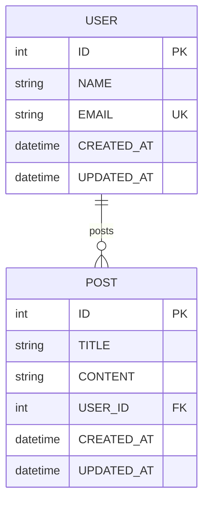

# Foundry Pipeline Architecture
### Deep Dive into the 4-Stage ERD Processing System

---

## Executive Summary

This document provides a comprehensive technical specification of Foundry's ERD processing pipeline. The architecture implements a **strict separation between AI extraction and deterministic code generation**, ensuring reliability, testability, and maintainability at enterprise scale.

**Key Innovation**: By using a strongly-typed Abstract Syntax Tree (AST) as an intermediate representation, Foundry decouples AI-powered visual analysis from code generation, eliminating formatting inconsistencies and enabling deterministic output.

---

## Table of Contents

1. [Pipeline Overview](#pipeline-overview)
2. [Stage 1: AI Extraction](#stage-1-ai-extraction)
3. [Stage 2: AST Building](#stage-2-ast-building)
4. [Stage 3: Validation](#stage-3-validation)
5. [Stage 4: Code Generation](#stage-4-code-generation)
6. [Type System](#type-system)
7. [Error Handling](#error-handling)
8. [Testing Strategy](#testing-strategy)
9. [Performance Metrics](#performance-metrics)

---

## Pipeline Overview

### Architecture Diagram

```
┌─────────────────────────────────────────────────────────────────────┐
│                        FOUNDRY PIPELINE                             │
│                                                                     │
│  Input: ERD Image (Buffer)                                          │
│  Output: GeneratedCode (5 files)                                    │
│  Processing Time: 45-60 seconds                                     │
└─────────────────────────────────────────────────────────────────────┘

┌─────────────────────────────────────────────────────────────────────┐
│  STAGE 1: AI EXTRACTION                                             │
│  ─────────────────────────────────────────────────────────────────  │
│  Module: lib/ai/extractor.ts                                        │
│  Input:  Buffer (image data)                                        │
│  Output: AIExtractionResult (JSON)                                  │
│  Time:   30-40 seconds                                              │
│                                                                     │
│  Process:                                                           │
│  1. Authenticate with IBM Cloud IAM                                 │
│  2. Call watsonx.ai Llama 3.2 90B Vision API                        │
│  3. Parse JSON response (3 fallback strategies)                     │
│  4. Validate structure (tables array, relations array)              │
└─────────────────────────────────────────────────────────────────────┘
                              ↓
┌─────────────────────────────────────────────────────────────────────┐
│  STAGE 2: AST BUILDING                                              │
│  ─────────────────────────────────────────────────────────────────  │
│  Module: lib/parser/ast-builder.ts                                  │
│  Input:  AIExtractionResult                                         │
│  Output: ERDAST (strongly-typed)                                    │
│  Time:   <1 second                                                  │
│                                                                     │
│  Process:                                                           │
│  1. Map AI field types → Prisma types                               │
│  2. Map AI relation types → RelationType enum                       │
│  3. Normalize all names (PascalCase/camelCase)                      │
│  4. Build ERDTable[] and ERDRelation[]                              │
└─────────────────────────────────────────────────────────────────────┘
                              ↓
┌─────────────────────────────────────────────────────────────────────┐
│  STAGE 3: VALIDATION                                                │
│  ─────────────────────────────────────────────────────────────────  │
│  Module: lib/validators/erd-validator.ts                            │
│  Input:  ERDAST                                                     │
│  Output: ValidatedERDAST                                            │
│  Time:   <1 second                                                  │
│                                                                     │
│  Process (7 steps):                                                 │
│  1. Normalize all names                                             │
│  2. Remove duplicate tables                                         │
│  3. Remove duplicate relations                                      │
│  4. Remove self-relations                                           │
│  5. Validate relation references                                    │
│  6. Infer missing inverse relations                                 │
│  7. Add foreign key fields                                          │
└─────────────────────────────────────────────────────────────────────┘
                              ↓
┌─────────────────────────────────────────────────────────────────────┐
│  STAGE 4: CODE GENERATION                                           │
│  ─────────────────────────────────────────────────────────────────  │
│  Modules: lib/generators/*.ts                                       │
│  Input:   ValidatedERDAST                                           │
│  Output:  GeneratedCode (5 files)                                   │
│  Time:    5-10 seconds                                              │
│                                                                     │
│  Generators:                                                        │
│  • prisma-generator.ts  → schema.prisma                             │
│  • api-generator.ts     → routes.ts (CRUD)                          │
│  • zod-generator.ts     → validation.ts                             │
│  • seed-generator.ts    → seed.ts (Faker)                           │
│  • mermaid-generator.ts → ERD diagram                               │
└─────────────────────────────────────────────────────────────────────┘
                              ↓
                    ┌─────────────────┐
                    │  GeneratedCode  │
                    │  (5 outputs)    │
                    └─────────────────┘
```

### Design Philosophy

1. **AI Extracts Structure, Not Code**: watsonx.ai returns only JSON—no code formatting issues
2. **AST as Single Source of Truth**: All generators consume the same validated AST
3. **Deterministic Output**: Same AST always produces identical code
4. **Type Safety**: Strongly-typed interfaces prevent runtime errors
5. **Testability**: Each stage can be unit tested independently

---

## Stage 1: AI Extraction

### Module: `lib/ai/extractor.ts`

### Purpose

Extract structured data from ERD images using IBM watsonx.ai vision model. This stage is the **only** part of the pipeline that interacts with AI—all subsequent stages are deterministic.

### Implementation

```typescript
export async function extractERDStructure(
  imageBuffer: Buffer
): Promise<AIExtractionResult> {
  // 1. Get IAM Token
  const tokenRes = await fetch('https://iam.cloud.ibm.com/identity/token', {
    method: 'POST',
    headers: { 'Content-Type': 'application/x-www-form-urlencoded' },
    body: `grant_type=urn:ibm:params:oauth:grant-type:apikey&apikey=${apiKey}`
  });
  
  const tokenData = await tokenRes.json();
  const accessToken = tokenData.access_token;
  
  // 2. Prepare image
  const base64Image = imageBuffer.toString('base64');
  const imageDataUrl = `data:image/png;base64,${base64Image}`;
  
  // 3. Call watsonx.ai Vision API
  const chatRes = await fetch(`${url}/ml/v1/text/chat?version=2024-05-31`, {
    method: 'POST',
    headers: {
      'Authorization': `Bearer ${accessToken}`,
      'Content-Type': 'application/json'
    },
    body: JSON.stringify({
      model_id: 'meta-llama/llama-3-2-90b-vision-instruct',
      project_id: projectId,
      messages: [
        {
          role: "user",
          content: [
            { type: "text", text: buildExtractionPrompt() },
            { type: "image_url", image_url: { url: imageDataUrl } }
          ]
        }
      ],
      max_tokens: 2000,
      temperature: 0.1  // Low temperature for consistency
    })
  });
  
  // 4. Parse response with fallback strategies
  const generatedText = chatData.choices?.[0]?.message?.content || "";
  
  let result: AIExtractionResult;
  try {
    // Strategy 1: Direct parse
    result = JSON.parse(generatedText);
  } catch (e) {
    // Strategy 2: Strip markdown and retry
    const cleaned = generatedText
      .replace(/```json\s*/g, '')
      .replace(/```\s*/g, '')
      .trim();
    
    // Strategy 3: Extract JSON block
    const jsonMatch = cleaned.match(/\{[\s\S]*\}/);
    if (jsonMatch) {
      result = JSON.parse(jsonMatch[0]);
    } else {
      throw new Error('Could not extract valid JSON from AI response');
    }
  }
  
  // 5. Validate structure
  if (!result.tables || !Array.isArray(result.tables)) {
    throw new Error('Invalid AI response: missing tables array');
  }
  if (!result.relations || !Array.isArray(result.relations)) {
    result.relations = []; // Relations are optional
  }
  
  return result;
}
```

### System Prompt Strategy

The prompt instructs the AI to return **ONLY structured JSON**, with explicit rules:

```typescript
function buildExtractionPrompt(): string {
  return `You are an expert database architect analyzing ERD images.

CRITICAL INSTRUCTIONS:
- Extract ONLY the structure as JSON
- Do NOT generate any code (no Prisma, no TypeScript, no SQL)
- Return ONLY valid JSON, no markdown, no explanations
- Do not wrap response in code blocks

Extract:
1. All tables/entities with their fields
2. All relationships between tables

JSON STRUCTURE:
{
  "tables": [
    {
      "name": "table_name",
      "fields": [
        {
          "name": "field_name",
          "type": "string|number|boolean|date",
          "required": true|false,
          "unique": true|false
        }
      ]
    }
  ],
  "relations": [
    {
      "from": "TableA",
      "to": "TableB",
      "type": "one-to-many|one-to-one|many-to-many",
      "name": "relationship_name"
    }
  ]
}

Now analyze the ERD image and return ONLY the JSON structure.`;
}
```

### Error Handling

```typescript
try {
  const result = await extractERDStructure(imageBuffer);
} catch (error) {
  if (error.message.includes('IAM Token')) {
    // Authentication failure
    throw new Error('Failed to authenticate with IBM Cloud. Check WATSONX_API_KEY.');
  } else if (error.message.includes('empty response')) {
    // AI returned nothing
    throw new Error('AI model returned empty response. Try a clearer image.');
  } else if (error.message.includes('JSON')) {
    // Parsing failure
    throw new Error('AI response was not valid JSON. Please retry.');
  } else {
    // Unknown error
    throw new Error(`ERD extraction failed: ${error.message}`);
  }
}
```

### Output Format

```typescript
interface AIExtractionResult {
  tables: Array<{
    name: string;              // e.g., "User", "BlogPost"
    fields: Array<{
      name: string;            // e.g., "email", "title"
      type: string;            // e.g., "string", "number"
      required?: boolean;      // Default: true
      unique?: boolean;        // Default: false
    }>;
  }>;
  relations: Array<{
    from: string;              // e.g., "User"
    to: string;                // e.g., "Post"
    type: string;              // e.g., "one-to-many"
    name?: string;             // e.g., "posts"
  }>;
}
```

---

## Stage 2: AST Building

### Module: `lib/parser/ast-builder.ts`

### Purpose

Convert AI's loosely-typed JSON into a strongly-typed Abstract Syntax Tree (AST) that serves as the single source of truth for all code generators.

### Type Mappings

#### Field Type Mapping

```typescript
function mapFieldType(aiType: string): PrismaFieldType {
  const normalized = aiType.toLowerCase();
  
  // String types
  if (normalized.includes('string') || 
      normalized.includes('text') || 
      normalized.includes('varchar')) {
    return 'String';
  }
  
  // Integer types
  if (normalized.includes('number') || 
      normalized.includes('int') || 
      normalized.includes('integer')) {
    return 'Int';
  }
  
  // Float types
  if (normalized.includes('float') || 
      normalized.includes('decimal') || 
      normalized.includes('double')) {
    return 'Float';
  }
  
  // Boolean types
  if (normalized.includes('bool')) {
    return 'Boolean';
  }
  
  // DateTime types
  if (normalized.includes('date') || 
      normalized.includes('time')) {
    return 'DateTime';
  }
  
  // Default fallback
  return 'String';
}
```

#### Relation Type Mapping

```typescript
function mapRelationType(aiType: string): RelationType {
  const normalized = aiType.toLowerCase().replace(/[_\s-]/g, '');
  
  if (normalized.includes('onetoone') || normalized === '11') {
    return 'one-to-one';
  }
  if (normalized.includes('onetomany') || normalized === '1n') {
    return 'one-to-many';
  }
  if (normalized.includes('manytoone') || normalized === 'n1') {
    return 'many-to-one';
  }
  if (normalized.includes('manytomany') || normalized === 'nm') {
    return 'many-to-many';
  }
  
  // Default to one-to-many
  return 'one-to-many';
}
```

### Name Normalization

All names are normalized during AST building:

```typescript
// Model names: Singular PascalCase
normalizeModelName("blog_posts") → "BlogPost"
normalizeModelName("Users")      → "User"

// Field names: camelCase
normalizeFieldName("user_id")    → "userId"
normalizeFieldName("FirstName")  → "firstName"
```

### Implementation

```typescript
export function buildERDAST(aiResult: AIExtractionResult): ERDAST {
  // Build tables
  const tables: ERDTable[] = aiResult.tables.map(aiTable => ({
    name: normalizeModelName(aiTable.name),
    fields: aiTable.fields.map(aiField => ({
      name: normalizeFieldName(aiField.name),
      type: mapFieldType(aiField.type),
      isRequired: aiField.required !== false,
      isUnique: aiField.unique === true,
      isArray: false,
      defaultValue: aiField.default
    }))
  }));
  
  // Build relations
  const relations: ERDRelation[] = aiResult.relations.map(aiRel => ({
    name: normalizeFieldName(aiRel.name || aiRel.to.toLowerCase()),
    from: normalizeModelName(aiRel.from),
    to: normalizeModelName(aiRel.to),
    type: mapRelationType(aiRel.type),
    onDelete: aiRel.onDelete || 'Cascade'
  }));
  
  return { tables, relations };
}
```

### Output Format

```typescript
interface ERDAST {
  tables: ERDTable[];
  relations: ERDRelation[];
}

interface ERDTable {
  name: string;              // PascalCase, singular
  fields: ERDField[];
}

interface ERDField {
  name: string;              // camelCase
  type: PrismaFieldType;     // Strongly-typed enum
  isRequired: boolean;
  isUnique: boolean;
  isArray: boolean;
  defaultValue?: string | number | boolean;
}

interface ERDRelation {
  name: string;              // camelCase
  from: string;              // Model name
  to: string;                // Model name
  type: RelationType;        // Strongly-typed enum
  fromField?: string;
  toField?: string;
  onDelete?: 'Cascade' | 'SetNull' | 'Restrict';
}
```

---

## Stage 3: Validation

### Module: `lib/validators/erd-validator.ts`

### Purpose

Normalize and validate the AST to ensure it meets Prisma's requirements and follows best practices. This stage transforms a basic AST into a production-ready `ValidatedERDAST`.

### 7-Step Validation Process

#### Step 1: Normalize Names

Ensure all names follow conventions:

```typescript
function normalizeNames(ast: ERDAST): ERDAST {
  return {
    tables: ast.tables.map(table => ({
      ...table,
      name: normalizeModelName(table.name),
      fields: table.fields.map(field => ({
        ...field,
        name: normalizeFieldName(field.name)
      }))
    })),
    relations: ast.relations.map(rel => ({
      ...rel,
      from: normalizeModelName(rel.from),
      to: normalizeModelName(rel.to),
      name: normalizeFieldName(rel.name)
    }))
  };
}
```

#### Step 2: Remove Duplicate Tables

```typescript
function deduplicateTables(tables: ERDTable[]): ERDTable[] {
  const seen = new Set<string>();
  return tables.filter(table => {
    if (seen.has(table.name)) {
      console.warn(`Duplicate table removed: ${table.name}`);
      return false;
    }
    seen.add(table.name);
    return true;
  });
}
```

#### Step 3: Remove Duplicate Relations

```typescript
function deduplicateRelations(relations: ERDRelation[]): ERDRelation[] {
  const seen = new Set<string>();
  return relations.filter(rel => {
    const key = `${rel.from}-${rel.to}-${rel.type}`;
    if (seen.has(key)) {
      console.warn(`Duplicate relation removed: ${key}`);
      return false;
    }
    seen.add(key);
    return true;
  });
}
```

#### Step 4: Remove Self-Relations

```typescript
function removeSelfRelations(relations: ERDRelation[]): ERDRelation[] {
  return relations.filter(rel => {
    if (rel.from === rel.to) {
      console.warn(`Self-relation removed: ${rel.from} → ${rel.to}`);
      return false;
    }
    return true;
  });
}
```

#### Step 5: Validate Relation References

```typescript
function validateRelationReferences(
  relations: ERDRelation[], 
  tables: ERDTable[]
): ERDRelation[] {
  const tableNames = new Set(tables.map(t => t.name));
  
  return relations.filter(rel => {
    const fromExists = tableNames.has(rel.from);
    const toExists = tableNames.has(rel.to);
    
    if (!fromExists) {
      console.warn(`Relation references non-existent table: ${rel.from}`);
    }
    if (!toExists) {
      console.warn(`Relation references non-existent table: ${rel.to}`);
    }
    
    return fromExists && toExists;
  });
}
```

#### Step 6: Infer Missing Inverse Relations

Prisma requires bidirectional relations. This step automatically adds missing inverse relations:

```typescript
function inferInverseRelations(
  relations: ERDRelation[], 
  tables: ERDTable[]
): ERDRelation[] {
  const enhanced: ERDRelation[] = [...relations];
  
  for (const rel of relations) {
    // For one-to-many, ensure we have the inverse many-to-one
    if (rel.type === 'one-to-many') {
      const inverseExists = enhanced.some(
        r => r.from === rel.to && r.to === rel.from && r.type === 'many-to-one'
      );
      
      if (!inverseExists) {
        enhanced.push({
          name: toCamelCase(rel.from.toLowerCase()),
          from: rel.to,
          to: rel.from,
          type: 'many-to-one',
          onDelete: rel.onDelete
        });
        console.log(`Inferred inverse relation: ${rel.to} → ${rel.from}`);
      }
    }
    
    // For many-to-one, ensure we have the inverse one-to-many
    if (rel.type === 'many-to-one') {
      const inverseExists = enhanced.some(
        r => r.from === rel.to && r.to === rel.from && r.type === 'one-to-many'
      );
      
      if (!inverseExists) {
        enhanced.push({
          name: toCamelCase(rel.to.toLowerCase()) + 's',
          from: rel.to,
          to: rel.from,
          type: 'one-to-many',
          onDelete: rel.onDelete
        });
        console.log(`Inferred inverse relation: ${rel.to} → ${rel.from}`);
      }
    }
  }
  
  return enhanced;
}
```

#### Step 7: Add Foreign Key Fields

Automatically add FK fields for many-to-one relations:

```typescript
function addForeignKeyFields(ast: ERDAST): ERDAST {
  const tables = [...ast.tables];
  
  for (const rel of ast.relations) {
    if (rel.type === 'many-to-one') {
      const fromTable = tables.find(t => t.name === rel.from);
      if (fromTable) {
        const fkFieldName = `${toCamelCase(rel.to)}Id`;
        
        // Check if FK field already exists
        const fkExists = fromTable.fields.some(f => f.name === fkFieldName);
        
        if (!fkExists) {
          fromTable.fields.push({
            name: fkFieldName,
            type: 'Int',
            isRequired: true,
            isUnique: false,
            isArray: false
          });
          console.log(`Added FK field: ${rel.from}.${fkFieldName}`);
        }
      }
    }
  }
  
  return { ...ast, tables };
}
```

### Main Validation Function

```typescript
export function validateERDAST(ast: ERDAST): ValidatedERDAST {
  console.log('Starting validation...');
  
  // Step 1: Normalize all names
  let validated = normalizeNames(ast);
  
  // Step 2: Remove duplicates
  validated.tables = deduplicateTables(validated.tables);
  validated.relations = deduplicateRelations(validated.relations);
  
  // Step 3: Remove self-relations
  validated.relations = removeSelfRelations(validated.relations);
  
  // Step 4: Validate relation references
  validated.relations = validateRelationReferences(
    validated.relations, 
    validated.tables
  );
  
  // Step 5: Infer inverse relations
  validated.relations = inferInverseRelations(
    validated.relations, 
    validated.tables
  );
  
  // Step 6: Add foreign key fields
  validated = addForeignKeyFields(validated);
  
  // Step 7: Deduplicate again after adding inverse relations
  validated.relations = deduplicateRelations(validated.relations);
  
  console.log('Validation complete');
  
  return {
    ...validated,
    validated: true,
    timestamp: new Date().toISOString()
  };
}
```

### Example Transformation

**Input AST:**
```typescript
{
  tables: [
    { name: "Users", fields: [{ name: "name", type: "String", ... }] },
    { name: "Posts", fields: [{ name: "title", type: "String", ... }] }
  ],
  relations: [
    { from: "Users", to: "Posts", type: "one-to-many", name: "posts" }
  ]
}
```

**Output ValidatedERDAST:**
```typescript
{
  tables: [
    { 
      name: "User",  // Singularized
      fields: [{ name: "name", type: "String", ... }] 
    },
    { 
      name: "Post",  // Singularized
      fields: [
        { name: "title", type: "String", ... },
        { name: "userId", type: "Int", ... }  // FK added
      ] 
    }
  ],
  relations: [
    { from: "User", to: "Post", type: "one-to-many", name: "posts" },
    { from: "Post", to: "User", type: "many-to-one", name: "user" }  // Inverse inferred
  ],
  validated: true,
  timestamp: "2026-05-17T06:00:00.000Z"
}
```

---

## Stage 4: Code Generation

### Overview

Five specialized generators consume the `ValidatedERDAST` and produce deterministic code output. Each generator is a pure function with no side effects.

### Generator 1: Prisma Schema (`lib/generators/prisma-generator.ts`)

**Purpose**: Generate complete `schema.prisma` file

**Key Features**:
- Datasource configuration (PostgreSQL/MySQL/SQLite)
- Generator block for Prisma Client
- Models with id, timestamps, and user fields
- Relation fields with proper `@relation` directives
- Foreign key constraints with onDelete behavior

**Implementation**:
```typescript
export function generatePrismaSchema(
  ast: ValidatedERDAST,
  dbType: string = 'postgresql'
): string {
  const sections: string[] = [];
  
  // Add datasource
  sections.push(generateDatasource(dbType));
  sections.push('');
  
  // Add generator
  sections.push(generateGenerator());
  sections.push('');
  
  // Add models
  for (const table of ast.tables) {
    sections.push(generateModel(table, ast.relations));
    sections.push('');
  }
  
  return sections.join('\n').trim();
}
```

**Example Output**:
```prisma
datasource db {
  provider = "postgresql"
  url      = env("DATABASE_URL")
}

generator client {
  provider = "prisma-client-js"
}

model User {
  id        Int      @id @default(autoincrement())
  name      String
  email     String   @unique
  posts     Post[]
  createdAt DateTime @default(now())
  updatedAt DateTime @updatedAt
}

model Post {
  id        Int      @id @default(autoincrement())
  title     String
  content   String
  userId    Int
  user      User     @relation(fields: [userId], references: [id], onDelete: Cascade)
  createdAt DateTime @default(now())
  updatedAt DateTime @updatedAt
}
```

### Generator 2: API Routes (`lib/generators/api-generator.ts`)

**Purpose**: Generate Next.js 14 App Router API routes with full CRUD operations

**Key Features**:
- GET all, GET by ID, POST, PUT, DELETE per model
- Proper error handling with try-catch
- HTTP status codes (200, 201, 404, 500)
- Prisma client integration
- TypeScript type safety

**Example Output**:
```typescript
import { NextResponse } from 'next/server';
import { PrismaClient } from '@prisma/client';

const prisma = new PrismaClient();

// GET /api/user - Get all users
export async function GET_USER() {
  try {
    const users = await prisma.user.findMany({
      include: {
        // Add relations here if needed
      }
    });
    return NextResponse.json(users);
  } catch (error) {
    console.error('Error fetching users:', error);
    return NextResponse.json(
      { error: 'Failed to fetch users' },
      { status: 500 }
    );
  }
}

// POST /api/user - Create user
export async function POST_USER(request: Request) {
  try {
    const body = await request.json();
    const user = await prisma.user.create({
      data: body
    });
    return NextResponse.json(user, { status: 201 });
  } catch (error) {
    console.error('Error creating user:', error);
    return NextResponse.json(
      { error: 'Failed to create user' },
      { status: 500 }
    );
  }
}
```

### Generator 3: Zod Schemas (`lib/generators/zod-generator.ts`)

**Purpose**: Generate Zod validation schemas for runtime type checking

**Key Features**:
- Create schemas (exclude id, timestamps, FKs)
- Update schemas (all fields optional)
- Intelligent type inference (email → z.string().email())
- TypeScript type exports

**Example Output**:
```typescript
import { z } from 'zod';

// User Schemas
export const CreateUserSchema = z.object({
  name: z.string().min(1),
  email: z.string().email(),
});

export const UpdateUserSchema = z.object({
  name: z.string().min(1).optional(),
  email: z.string().email().optional(),
});

export type CreateUserInput = z.infer<typeof CreateUserSchema>;
export type UpdateUserInput = z.infer<typeof UpdateUserSchema>;
```

### Generator 4: Seed Script (`lib/generators/seed-generator.ts`)

**Purpose**: Generate Prisma seed script with Faker.js for realistic test data

**Key Features**:
- 10 records per model
- Intelligent field-to-faker mapping
- Respects FK order (parents before children)
- Proper error handling and disconnect

**Field Mapping Examples**:
```typescript
email     → faker.internet.email()
name      → faker.person.fullName()
title     → faker.lorem.sentence()
content   → faker.lorem.paragraph()
age       → faker.number.int({ min: 18, max: 80 })
price     → parseFloat(faker.commerce.price())
phone     → faker.phone.number()
address   → faker.location.streetAddress()
```

**Example Output**:
```typescript
import { PrismaClient } from '@prisma/client';
import { faker } from '@faker-js/faker';

const prisma = new PrismaClient();

async function main() {
  console.log('Starting database seed...');
  
  // Create 10 User records
  console.log('Seeding User...');
  const users = [];
  for (let i = 0; i < 10; i++) {
    const user = await prisma.user.create({
      data: {
        name: faker.person.fullName(),
        email: faker.internet.email(),
      }
    });
    users.push(user);
  }
  console.log(`Created ${users.length} User records`);
  
  console.log('✅ Database seeded successfully!');
}

main()
  .catch((error) => {
    console.error('Error seeding database:', error);
    process.exit(1);
  })
  .finally(async () => {
    await prisma.$disconnect();
  });
```

### Generator 5: Mermaid Diagram (`lib/generators/mermaid-generator.ts`)

**Purpose**: Generate Mermaid ERD diagram syntax for visualization

**Key Features**:
- Proper cardinality notation (||--o{, ||--||, }o--o{)
- Entity blocks with field types
- PK/FK/UK annotations
- Sanitized names for Mermaid compatibility

**Example Output**:


---

## Type System

### Complete Type Hierarchy

```typescript
// ============================================
// AI Layer Types
// ============================================

interface AIExtractionResult {
  tables: Array<{
    name: string;
    fields: Array<{
      name: string;
      type: string;
      required?: boolean;
      unique?: boolean;
    }>;
  }>;
  relations: Array<{
    from: string;
    to: string;
    type: string;
    name?: string;
  }>;
}

// ============================================
// AST Layer Types
// ============================================

type PrismaFieldType = 
  | 'String' 
  | 'Int' 
  | 'Float' 
  | 'Boolean' 
  | 'DateTime' 
  | 'Json';

type RelationType = 
  | 'one-to-one' 
  | 'one-to-many' 
  | 'many-to-one' 
  | 'many-to-many';

interface ERDField {
  name: string;
  type: PrismaFieldType;
  isRequired: boolean;
  isUnique: boolean;
  isArray: boolean;
  defaultValue?: string | number | boolean;
}

interface ERDRelation {
  name: string;
  from: string;
  to: string;
  type: RelationType;
  fromField?: string;
  toField?: string;
  onDelete?: 'Cascade' | 'SetNull' | 'Restrict';
}

interface ERDTable {
  name: string;
  fields: ERDField[];
}

interface ERDAST {
  tables: ERDTable[];
  relations: ERDRelation[];
}

interface ValidatedERDAST extends ERDAST {
  validated: true;
  timestamp: string;
}

// ============================================
// Output Layer Types
// ============================================

interface GeneratedCode {
  prismaSchema: string;
  apiRoutes: string;
  zodSchemas: string;
  seedScript: string;
  mermaidDiagram: string;
}
```

---

## Error Handling

### Error Categories

1. **Authentication Errors**: IAM token failures
2. **AI Errors**: Empty or invalid responses
3. **Parsing Errors**: JSON parsing failures
4. **Validation Errors**: Invalid AST structure
5. **Generation Errors**: Code generation failures

### Error Handling Strategy

```typescript
// Orchestrator error handling
export async function processERDImage(
  imageBuffer: Buffer,
  dbType: string = 'postgresql'
): Promise<GeneratedCode> {
  try {
    console.log('🚀 Starting ERD pipeline...');
    
    // Stage 1: AI Extraction
    const aiResult = await extractERDStructure(imageBuffer);
    
    // Stage 2: AST Building
    const ast = buildERDAST(aiResult);
    
    // Stage 3: Validation
    const validatedAST = validateERDAST(ast);
    
    // Stage 4: Code Generation
    return {
      prismaSchema: generatePrismaSchema(validatedAST, dbType),
      apiRoutes: generateApiRoutes(validatedAST),
      zodSchemas: generateZodSchemas(validatedAST),
      seedScript: generateSeedScript(validatedAST),
      mermaidDiagram: generateMermaidDiagram(validatedAST)
    };
    
  } catch (error) {
    console.error('❌ Pipeline error:', error);
    
    // Categorize error
    if (error.message.includes('IAM')) {
      throw new Error('Authentication failed. Check WATSONX_API_KEY.');
    } else if (error.message.includes('AI')) {
      throw new Error('AI extraction failed. Try a clearer image.');
    } else if (error.message.includes('JSON')) {
      throw new Error('Failed to parse AI response. Please retry.');
    } else if (error.message.includes('validation')) {
      throw new Error('AST validation failed. Check ERD structure.');
    } else {
      throw new Error(`Pipeline failed: ${error.message}`);
    }
  }
}
```

---

## Testing Strategy

### Unit Tests

Each stage should have comprehensive unit tests:

```typescript
// Stage 1: AI Extraction
describe('extractERDStructure', () => {
  it('should extract tables and relations from valid image', async () => {
    const mockBuffer = Buffer.from('...');
    const result = await extractERDStructure(mockBuffer);
    expect(result.tables).toHaveLength(2);
    expect(result.relations).toHaveLength(1);
  });
  
  it('should throw error on invalid IAM token', async () => {
    process.env.WATSONX_API_KEY = 'invalid';
    await expect(extractERDStructure(mockBuffer)).rejects.toThrow('IAM');
  });
});

// Stage 2: AST Building
describe('buildERDAST', () => {
  it('should map AI types to Prisma types', () => {
    const aiResult = { tables: [{ name: 'User', fields: [{ name: 'age', type: 'number' }] }], relations: [] };
    const ast = buildERDAST(aiResult);
    expect(ast.tables[0].fields[0].type).toBe('Int');
  });
  
  it('should normalize model names to singular PascalCase', () => {
    const aiResult = { tables: [{ name: 'users', fields: [] }], relations: [] };
    const ast = buildERDAST(aiResult);
    expect(ast.tables[0].name).toBe('User');
  });
});

// Stage 3: Validation
describe('validateERDAST', () => {
  it('should remove duplicate tables', () => {
    const ast = { tables: [{ name: 'User', fields: [] }, { name: 'User', fields: [] }], relations: [] };
    const validated = validateERDAST(ast);
    expect(validated.tables).toHaveLength(1);
  });
  
  it('should infer inverse relations', () => {
    const ast = { 
      tables: [{ name: 'User', fields: [] }, { name: 'Post', fields: [] }],
      relations: [{ from: 'User', to: 'Post', type: 'one-to-many', name: 'posts' }]
    };
    const validated = validateERDAST(ast);
    expect(validated.relations).toHaveLength(2);
    expect(validated.relations[1].type).toBe('many-to-one');
  });
});

// Stage 4: Code Generation
describe('generatePrismaSchema', () => {
  it('should generate valid Prisma schema', () => {
    const ast = { tables: [{ name: 'User', fields: [{ name: 'email', type: 'String', isRequired: true, isUnique: true, isArray: false }] }], relations: [], validated: true, timestamp: '' };
    const schema = generatePrismaSchema(ast);
    expect(schema).toContain('model User');
    expect(schema).toContain('email     String   @unique');
  });
});
```

### Integration Tests

Test the entire pipeline end-to-end:

```typescript
describe('processERDImage', () => {
  it('should process ERD image and generate all files', async () => {
    const imageBuffer = fs.readFileSync('test/fixtures/erd.png');
    const result = await processERDImage(imageBuffer, 'postgresql');
    
    expect(result.prismaSchema).toContain('datasource db');
    expect(result.apiRoutes).toContain('export async function');
    expect(result.zodSchemas).toContain('import { z }');
    expect(result.seedScript).toContain('import { faker }');
    expect(result.mermaidDiagram).toContain('erDiagram');
  });
});
```

---

## Performance Metrics

### Benchmarks

| Stage | Average Time | Max Time | Notes |
|-------|-------------|----------|-------|
| AI Extraction | 35s | 50s | Depends on image size and complexity |
| AST Building | 50ms | 200ms | Pure computation |
| Validation | 100ms | 500ms | Depends on number of tables/relations |
| Code Generation | 5s | 10s | All 5 generators combined |
| **Total** | **45s** | **60s** | End-to-end processing |

### Optimization Opportunities

1. **Parallel Generation**: Run all 5 generators concurrently
2. **AST Caching**: Cache validated ASTs for repeated generations
3. **Streaming**: Stream large files instead of buffering
4. **Worker Threads**: Offload heavy computation to worker threads

---

## Conclusion

Foundry's 4-stage pipeline architecture provides a robust, maintainable, and scalable solution for ERD-to-code generation. By strictly separating AI extraction from deterministic code generation and using a strongly-typed AST as an intermediate representation, the system achieves both flexibility and reliability—essential for enterprise production environments.

The modular design ensures that each component can be tested, optimized, or replaced independently, making Foundry a future-proof solution for automated backend generation.

---

*For high-level architecture, see [ARCHITECTURE.md](./ARCHITECTURE.md)*  
*For watsonx.ai integration details, see [WATSONX_INTEGRATION.md](./WATSONX_INTEGRATION.md)*