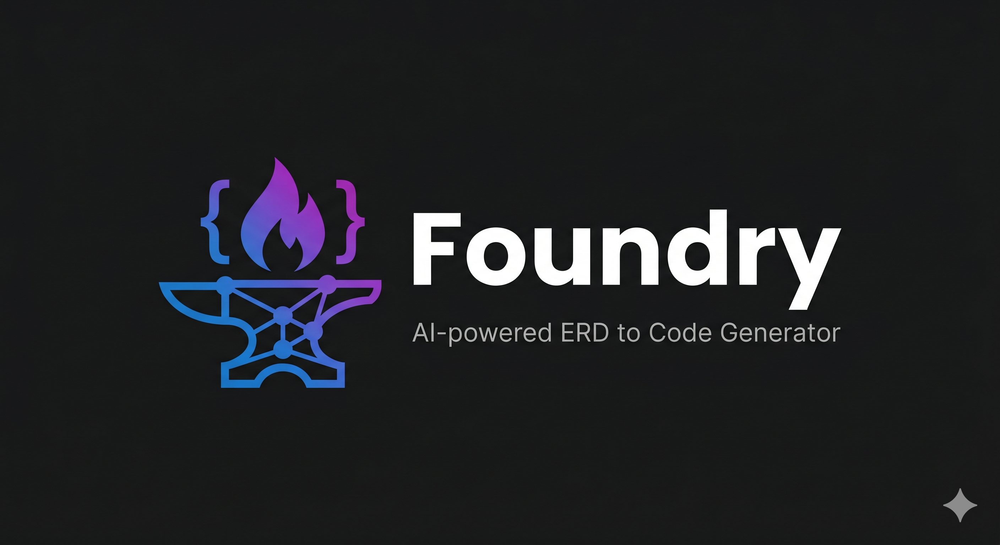

<div align="center">


<br />

### Transform ERD Diagrams into Production-Ready Backend Code — in 60 Seconds

<br />

[](https://www.ibm.com/watsonx)
[](https://www.ibm.com/)
[](https://nextjs.org)
[](https://typescriptlang.org)
[](LICENSE)

<br />

**🏆 Built for IBM Bob Hackathon 2026 · Theme: "Turn Idea Into Impact Faster"**

<br />

[Features](#-features) · [Quick Start](#-quick-start) · [How It Works](#-how-it-works) · [Tech Stack](#-tech-stack) · [Roadmap](#-roadmap)

<br />

</div>

---

## The Problem

A developer gets an ERD diagram from their system analyst.

Translating it into a production-ready Prisma schema, full CRUD API routes, Docker config, TypeScript types, and environment setup — **manually — takes 2–5 hours.**

## The Solution

**Foundry does it in 60 seconds.**

Upload ERD → Select database → Download a complete 9-file production bundle. That's it.

---

## ✨ Features

### 🚀 Live & Working

| | Feature | Description |
|---|---|---|
| 🤖 | **AI Vision ERD Analysis** | IBM watsonx.ai Llama 3.2 90B Vision reads every entity, relationship, and constraint from your diagram |
| 🗄️ | **Database Type Selector** | Choose PostgreSQL, MySQL, or SQLite before generating |
| 📝 | **Prisma Schema Generator** | Production-ready schema with `@relation`, camelCase fields, auto-timestamps, and proper constraints |
| 🔌 | **Next.js API Routes** | Full CRUD (GET, POST, PUT, DELETE) for every detected model with error handling |
| 🔮 | **Live ERD Diagram** | Reverse-engineered Mermaid.js diagram rendered in real-time from generated code |
| ✏️ | **Monaco Editor** | VS Code-powered editor — review and edit schema & routes directly in the browser |
| 📖 | **Setup Guide Tab** | Step-by-step commands to use your generated code immediately |
| 📦 | **9-File ZIP Bundle** | One click, everything you need |
| ⏳ | **Smart Loading UX** | Animated progress bar with contextual messages during AI processing |

### 📦 What's Inside the ZIP

```
foundry-output.zip
├── schema.prisma              # Production-ready Prisma schema
├── routes.ts                  # Next.js API routes — full CRUD
├── types.ts                   # Auto-generated TypeScript interfaces
├── README.md                  # Dynamic setup guide with your models
├── .gitignore                 # Pre-configured
├── .env.example               # Environment variable template
├── Dockerfile                 # Docker container config
├── docker-compose.yml         # Complete Docker Compose setup
└── app/api/health/route.ts    # Health check endpoint
```

### 🔮 Coming Soon

| Feature | Status |
|---|---|
| 🚀 Deploy to Neon | `planned` |
| 🐙 Push to GitHub | `planned` |
| 🐳 Docker Deploy | `planned` |

---

## 🎯 How It Works

```
  ┌──────────────┐     ┌──────────────┐     ┌───────────────────────┐
  │  1. SELECT   │     │  2. UPLOAD   │     │     3. AI ANALYZES    │
  │              │     │              │     │                       │
  │ PostgreSQL   │────▶│  [ERD Image] │────▶│  watsonx.ai Vision   │
  │ MySQL        │     │              │     │  Llama 3.2 90B        │
  │ SQLite       │     │              │     │                       │
  └──────────────┘     └──────────────┘     └───────────┬───────────┘
                                                        │
  ┌──────────────┐     ┌──────────────┐     ┌───────────▼───────────┐
  │  6. DOWNLOAD │     │  5. EDIT     │     │     4. GENERATE       │
  │              │     │              │     │                       │
  │  9-File ZIP  │◀────│ Monaco Editor│◀────│  Prisma Schema        │
  │              │     │              │     │  API Routes           │
  │              │     │              │     │  Mermaid Diagram      │
  └──────────────┘     └──────────────┘     └───────────────────────┘
```

---

## 🚀 Quick Start

### Prerequisites

- Node.js 18+
- IBM Cloud account with watsonx.ai access

### Installation

```bash
# 1. Clone the repository
git clone <your-repo-url>
cd foundry

# 2. Install dependencies
npm install

# 3. Set up environment variables
cp .env.example .env.local
```

### Environment Variables

Edit `.env.local` with your IBM watsonx.ai credentials:

```bash
WATSONX_API_KEY=your_api_key_here
WATSONX_URL=https://us-south.ml.cloud.ibm.com
WATSONX_PROJECT_ID=your_project_id_here
```

```bash
# 4. Start development server
npm run dev
```

Open [http://localhost:3000](http://localhost:3000) — Foundry is ready. 🎉

---

## 🏗️ Project Structure

```
foundry/
├── app/
│   ├── api/
│   │   └── generate/
│   │       └── route.ts       # Main API endpoint — watsonx.ai integration
│   ├── results/
│   │   └── page.tsx           # Results page — Monaco editors + Mermaid
│   ├── globals.css
│   ├── layout.tsx
│   └── page.tsx               # Home — upload zone + database selector
├── lib/
│   └── watsonx.ts             # IBM watsonx.ai vision integration
├── .env.example
└── .env.local                 # Your credentials — never committed
```

---

## 🎨 Tech Stack

| Category | Technology |
|---|---|
| Framework | Next.js 14 — App Router |
| Language | TypeScript 5 |
| Styling | Tailwind CSS |
| Code Editor | Monaco Editor (`@monaco-editor/react`) |
| AI Vision | IBM watsonx.ai — Llama 3.2 90B Vision Instruct |
| Diagrams | Mermaid.js via mermaid.ink |
| ZIP Generation | JSZip |
| File Upload | react-dropzone |
| Icons | Lucide React |
| Built With | IBM Bob IDE |

---

## 🔐 Security

- ✅ File type validation — PNG, JPG, JPEG only
- ✅ File size limit — max 10MB
- ✅ API keys stored server-side only — never exposed to client
- ✅ `.env.local` excluded from git
- ✅ Stateless processing — no user data stored

---

## 🗺️ Roadmap

```
V1 — Current  ·  IBM Bob Hackathon 2026
├── ✅ AI Vision ERD Analysis
├── ✅ Multi-database support (PostgreSQL, MySQL, SQLite)
├── ✅ 9-file production ZIP bundle
├── ✅ Live Mermaid ERD diagram
└── ✅ Monaco Editor with real-time editing

V2 — Developer Tools
├── 🔄 Migration script generator
├── 🔄 Seed data generator
├── 🔄 AI schema security validator
└── 🔄 Postman collection export

V3 — Platform
├── 🔄 Canvas ERD editor (drag-and-drop)
├── 🔄 Text-to-diagram generator
├── 🔄 Deploy to Neon / Push to GitHub
└── 🔄 Multi-file ERD upload

V4 — Collaboration
├── 🔄 Team workspaces
├── 🔄 History & sessions
├── 🔄 Multi-framework (Django, Mongoose, Sequelize)
└── 🔄 Role-based access control
```

---

## 🏆 IBM Bob Hackathon 2026

**Theme:** *"Turn idea into impact faster"*

Foundry was built entirely using **IBM Bob IDE** as the AI development partner — scaffolding the project, integrating watsonx.ai, debugging complex issues, and generating documentation.

**Why Foundry fits the theme:**
- Eliminates 2–5 hours of repetitive backend boilerplate
- Makes backend setup accessible to junior developers
- Demonstrates IBM watsonx.ai vision capabilities in a real developer workflow
- Shows how IBM Bob accelerates complex full-stack development end-to-end

---

<div align="center">

<br />

**Built with ❤️ using IBM Bob IDE, Next.js 14, and IBM watsonx.ai**

<br />

⭐ **Star this repo if Foundry saved you time!**

<br />

[Report Bug](../../issues) · [Request Feature](../../issues) · [IBM Bob Hackathon](https://lablab.ai)

<br />

</div>
