# Foundry - Visual Architecture Summary

This document provides visual representations of the Foundry application architecture and workflows.

## System Overview

```mermaid
graph TB
    subgraph "Frontend - Next.js 14"
        A[Upload Page] --> B[Image Uploader]
        B --> C[Preview Page]
        C --> D[Schema Editor]
        D --> E[Code Preview]
        E --> F[Download Manager]
    end
    
    subgraph "API Layer"
        G[/api/analyze-erd]
        H[/api/generate-schema]
        I[/api/generate-routes]
    end
    
    subgraph "Services"
        J[watsonx.ai Client]
        K[Vision Service]
        L[ERD Parser]
        M[Prisma Generator]
        N[Route Generator]
    end
    
    subgraph "External"
        O[watsonx.ai API]
    end
    
    B --> G
    G --> J
    J --> O
    O --> K
    K --> L
    L --> C
    
    D --> H
    H --> M
    M --> E
    
    D --> I
    I --> N
    N --> E
    
    E --> F
```

## Complete User Flow

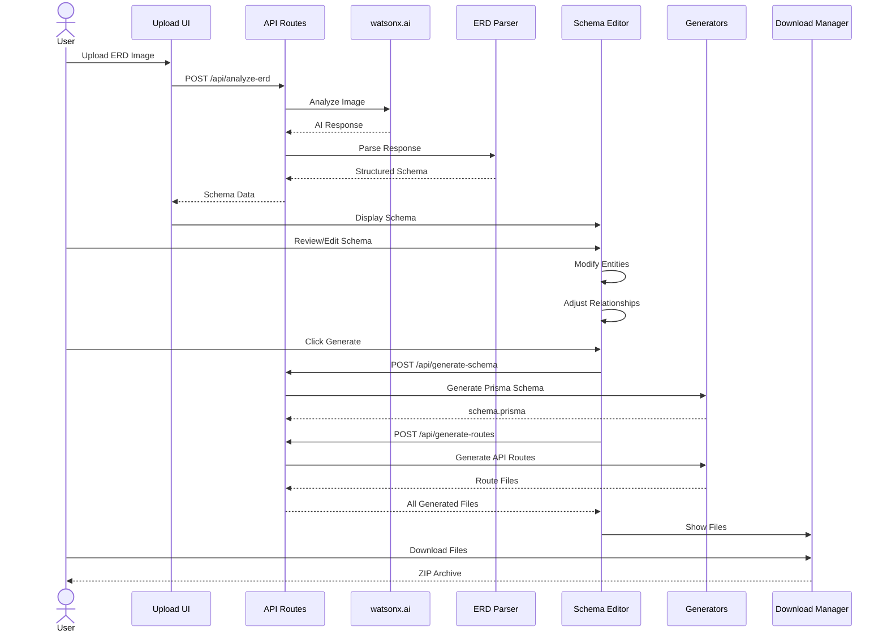

## Data Flow Architecture

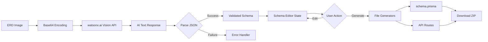

## Component Hierarchy

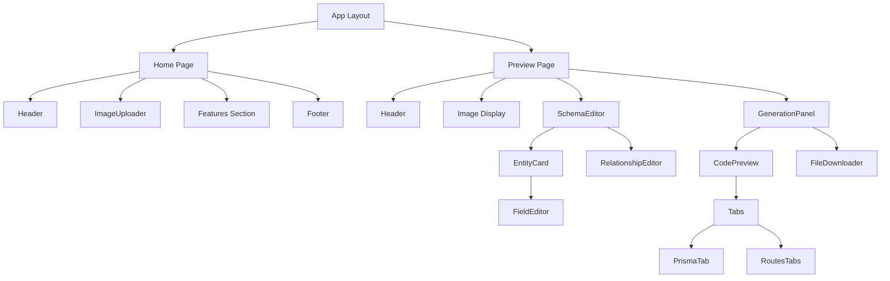

## File Generation Process

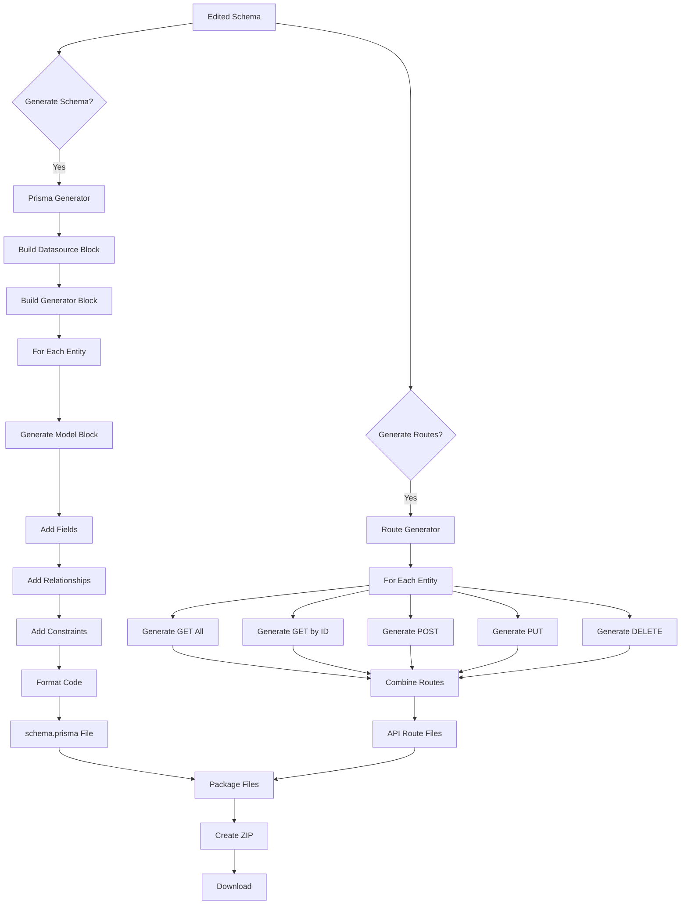

## Schema Editor State Management

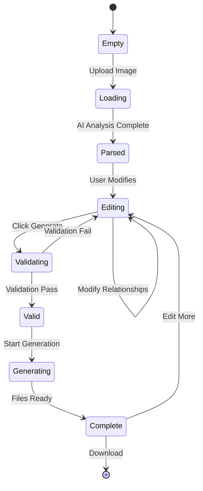

## API Route Structure

```mermaid
graph LR
    A[API Routes] --> B[/api/analyze-erd]
    A --> C[/api/generate-schema]
    A --> D[/api/generate-routes]
    
    B --> E[POST: Upload & Analyze]
    C --> F[POST: Generate Prisma]
    D --> G[POST: Generate Routes]
    
    E --> H[watsonx.ai Service]
    F --> I[Prisma Generator]
    G --> J[Route Generator]
    
    H --> K[Vision Model]
    I --> L[Template Engine]
    J --> L
```

## Entity Relationship Example

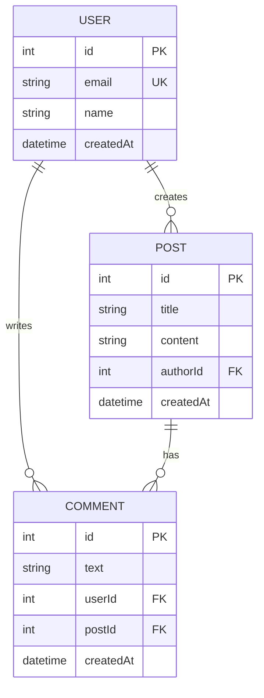

## Prisma Schema Generation Flow

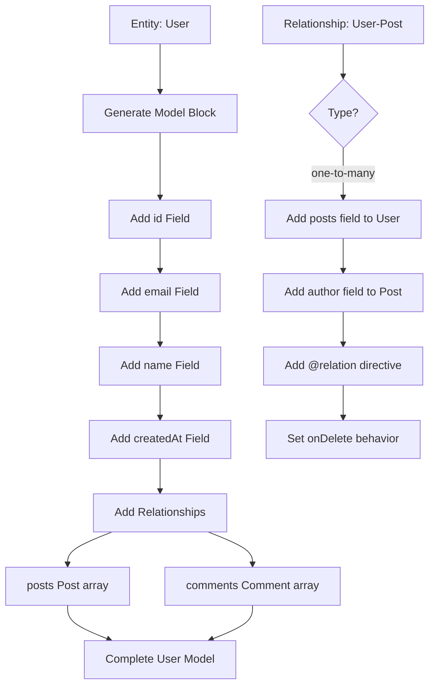

## Error Handling Flow

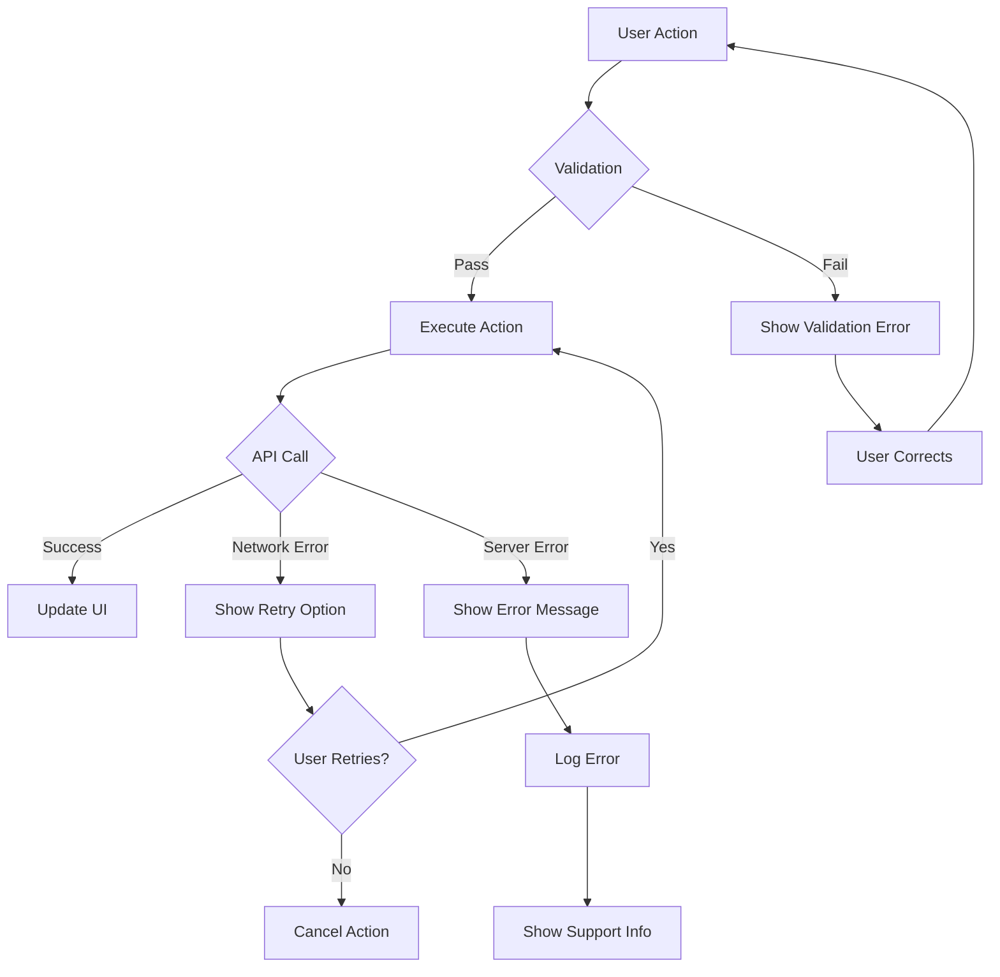

## File Download Process

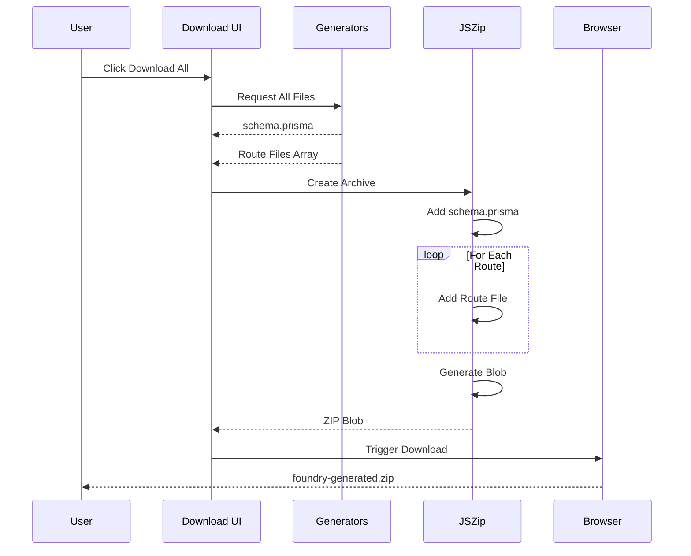

## Technology Stack Layers

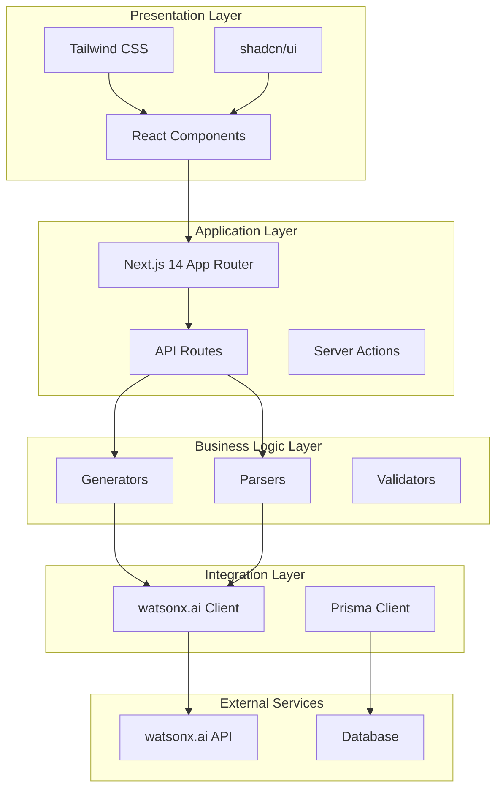

## Deployment Architecture

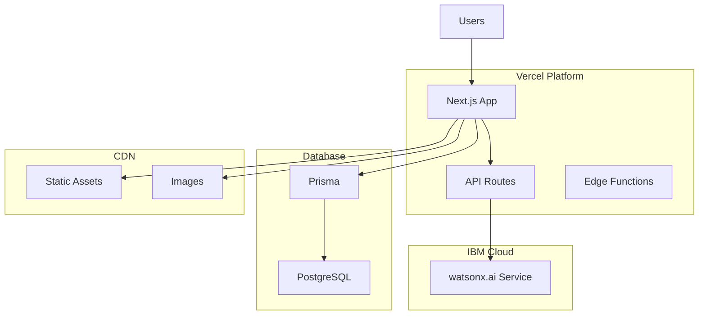

## Security Layers

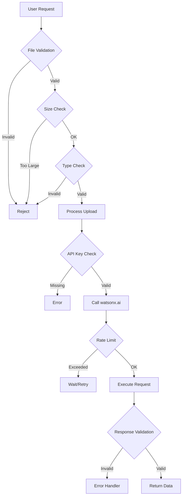

## Performance Optimization Points

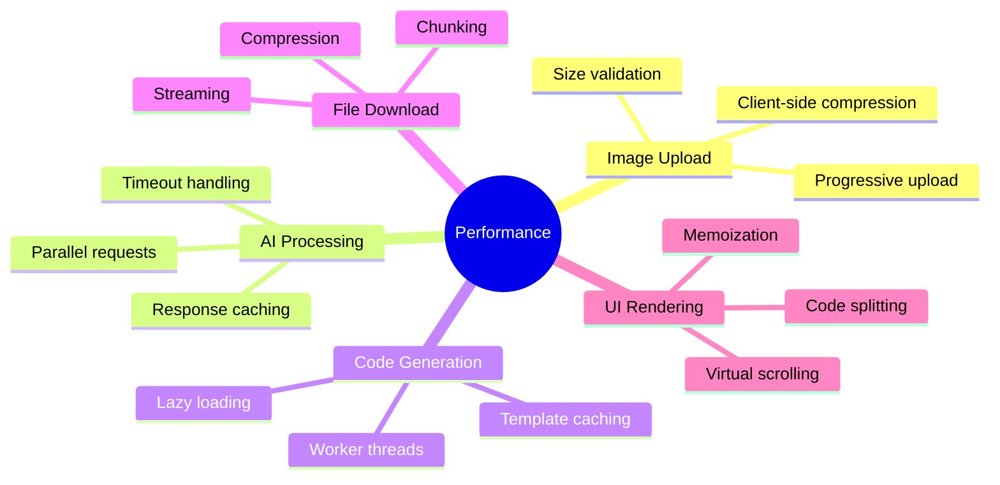

## Future Enhancement Roadmap

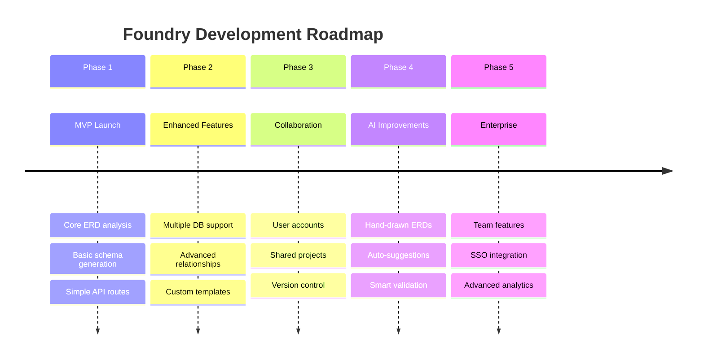

## Key Metrics to Monitor

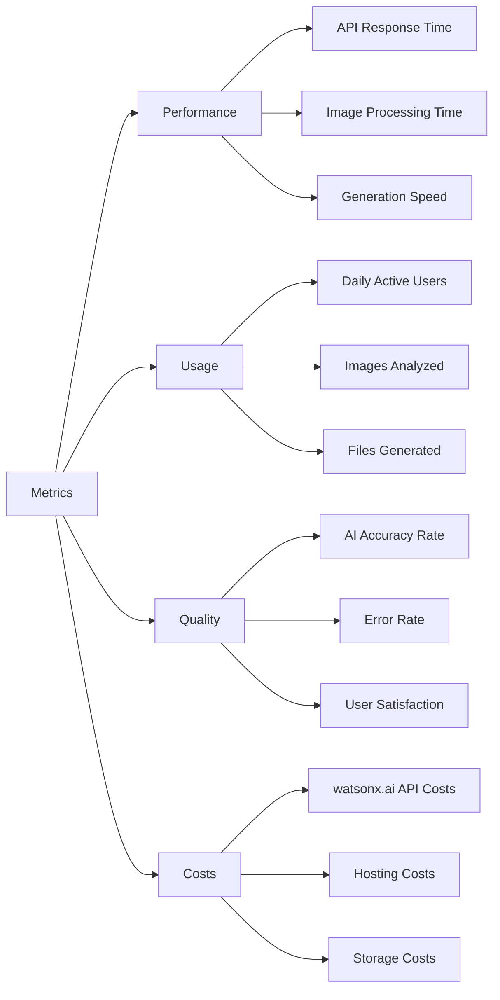

---

These diagrams provide a comprehensive visual overview of the Foundry application architecture. Use them as reference during development and for team communication.